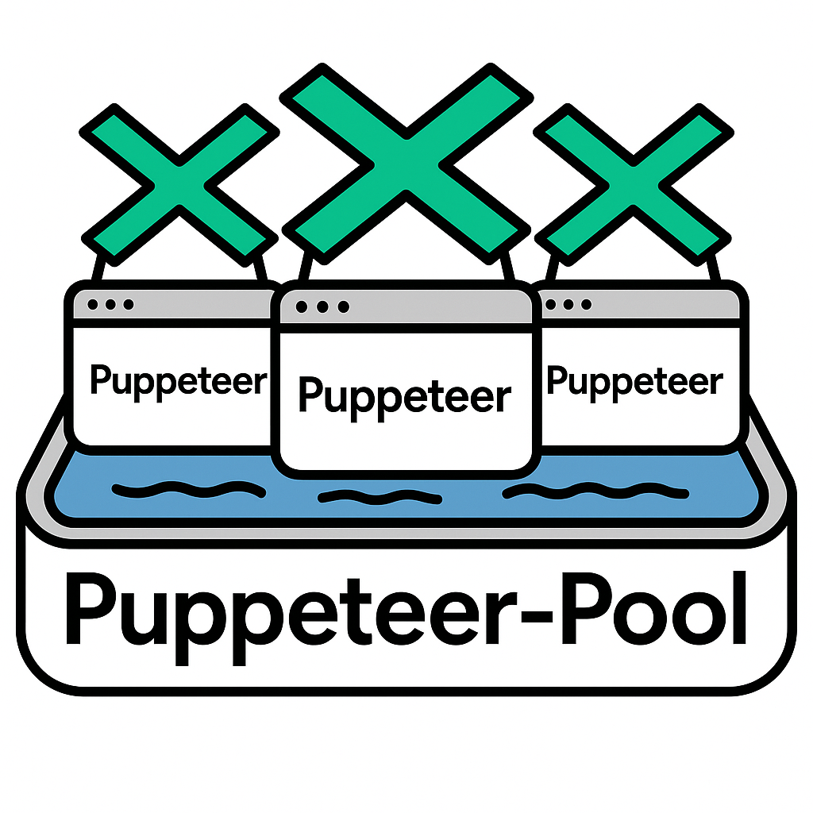

# Puppeteer Pool Manager


### Puppeteer Pool Manager

<div style="display: flex; align-items: center;">
  <div style="flex: 1;">

Puppeteer-Pool is a lightweight and efficient library for managing multiple Puppeteer contexts with ease. Designed for scalable web scraping and automation, it helps you handle concurrency and resource management without the hassle.

  </div>
  <div>
    
  </div>
</div>
## Package Installation

- `npm`

  ```
  npm i puppeteer @hoplin/puppeteer-pool
  ```

- `yarn`

  ```
  yarn add puppeteer @hoplin/puppeteer-pool
  ```

- `pnpm`
  ```
  pnpm install puppeteer @hoplin/puppeteer-pool
  ```

## Release 2.1.0

- Garbage collection is executed at the end of each context task
- Client's method are now all 'static'. You don't need to create instance of client and need migration if you are using previous version(`< 2.1.0`).
  - `getPoolMetrics`
  - `runTask`
  - `stop`
  - `checkInstanceInitalized`
- Add Priority Queue for task queue

  - `taskQueueType` option is added to `PuppeteerPoolStartOptions`

    - Priorty can be specified in the second factor of 'PuppeteerPool.runTask'. The larger the number, the higher the priority, and the priority is ignored in the Default Queue.
    - Enum: `QueueMode`
    - Example

      ```typescript
      import {
        ContextMode,
        PuppeteerPool,
        QueueMode,
      } from '@hoplin/puppeteer-pool';

      const priority = 10;

      await PuppeteerPool.start({
        taskQueueType: QueueMode.PRIORITY,
      });

      PuppeteerPool.runTask(async (page) => {
        await page.goto(url);
        const title = await page.title();
        return title;
      }, priority);
      ```

**[ Client API ]**

- PuppeteePool
  - `PuppeteerPool` is singleton class. You can use `PuppeteerPool.start` to initialize pool manager.
- PuppeteerPool.start

  - Static Method
  - Description: Initialize pool manager. You need to call this function to start puppeteer pool. Even if you invoke
    this function multiple times with differenct arguments, it will return the first initialized instance.
  - Args: `PuppeteerPoolStartOptions`

    ```typescript
    type PuppeteerPoolStartOptions = {
      /**
       * Number of concurrency,
       * Default is 3
       */
      concurrencyLevel: number;
      /**
       * Context mode
       * Default is ContextMode.SHARED
       */
      contextMode: ContextMode;
      /**
       * Puppeteer launch options
       * Default is {}
       */
      options?: puppeteer.LaunchOptions;
      /**
       * Custom config path
       */
      customConfigPath?: string;
      /**
       * Enable log
       * Default is true
       */
      enableLog?: boolean;
      /**
       * Log level
       * Default is LogLevel.DEBUG
       */
      logLevel?: LogLevel;
    };
    ```

  - Return
    - `Promise<PuppeteerPool>`
    - Returns PuppeteerPool Instance.

- PuppeteerPool.stop
  - Static Method
  - Description: Stop pool manager. It will close all sessions and terminate pool manager.
  - Return
    - `Promise<void>`
- PuppeteerPool.runTask
  - Static Method
  - Description: Run task in pool manager. It will return result of task.
  - Args
  - task
    - Required
    - Function
  - Return
  - `Promise<any>`
  - Returns result of task(Same return type with task callback return type)
- PuppeteerPool.getPoolMetrics
  - Static Method
  - Description: Get pool metrics. It will return metrics of pool manager.
  - Return
    ```json
        {
            memoryUsageValue: (Memory Usage in MegaBytes),
            memoryUsagePercentage: (Memory Usage with percentage),
            cpuUsage: (CPU Usage with percentage)
        }
    ```

## Simple Demo

```typescript
import { ContextMode, PuppeteerPool, QueueMode } from '@hoplin/puppeteer-pool';

async function main() {
  await PuppeteerPool.start({
    concurrencyLevel: 6,
    contextMode: ContextMode.ISOLATED,
    customConfigPath: `./puppeteer-pool-config.json`,
    taskQueueType: QueueMode.PRIORITY,
  });

  const baseUrls = [
    'https://www.google.com',
    'https://www.bing.com',
    'https://github.com',
    'https://www.naver.com',
    'https://www.daum.net',
    'https://www.youtube.com',
    'https://www.amazon.com',
    'https://www.netflix.com',
  ];

  const urls = Array.from({ length: 50 }, (_, index) => {
    const baseUrl = baseUrls[index % baseUrls.length];
    const priority = Math.floor(Math.random() * 10) + 1;
    return { url: baseUrl, priority: priority };
  });

  const promises = urls.map(({ url, priority }) => {
    console.log(`Enqueue task: ${url}`);
    return PuppeteerPool.runTask(async (page) => {
      console.log(`Process task for ${url} with priority ${priority}`);
      await page.goto(url);
      const title = await page.title();
      return title;
    }, priority);
  });

  const titles = await Promise.all(promises);
  console.log('[ Result length ] :', titles.length);
  console.log('[ Expected Tasks ] :', urls.length);
  console.log('[ Metrics ] :', await PuppeteerPool.getPoolMetrics());
}

main();
```

## Support

- Pool Managing
- Config
  - Support config customize
- Threshold Watcher
  - CPU
  - Memory
  - Support safe pool instance reset in runtime
- Metrics
  - Support Metric by pool
    - CPU usage of pool
    - Memory usage of pool
    - Managing session count in runtime

## Puppeteer Pool Manager Config

Default config should be `puppeteer-pool-config.json` in root directory path.

### Default config setting

If config file are not given or invalid path, manager will use default defined configurations. Or if you want to pass
config path, you can pass path to `start()` function as parameter.

```json
{
  "session_pool": {
    "width": 1080,
    "height": 1024
  },
  "context": {
    "timeout": 10
  },
  "threshold": {
    "activate": true,
    "interval": 5,
    "cpu": 80,
    "memory": 2048
  }
}
```

### `session_pool`

- `width`: Width of session pool
- `height`: Height of session pool
  - **Inteager Validation**
    - `width` should be larger or equal than 50
    - `height` should be larger or equal than 50
    - `width` should be integer
    - `height` should be integer

### `context`

- `timeout`: Timeout of context.
  - **Inteager Validation**
    - `timeout` should be at least 1
    - `timeout` should be integer

### `threshold`

- `activate`: Activate threshold watcher
- `interval`: Interval of threshold watcher
- `cpu`: CPU threshold value
- `memory`: Memory threshold value
  - **Inteager Validation**
    - `interval` should be at least 1
    - `interval` should be integer
    - `cpu` should be at least 1
    - `cpu` should be integer
    - `memory` should be at least 1
    - `memory` should be integer
